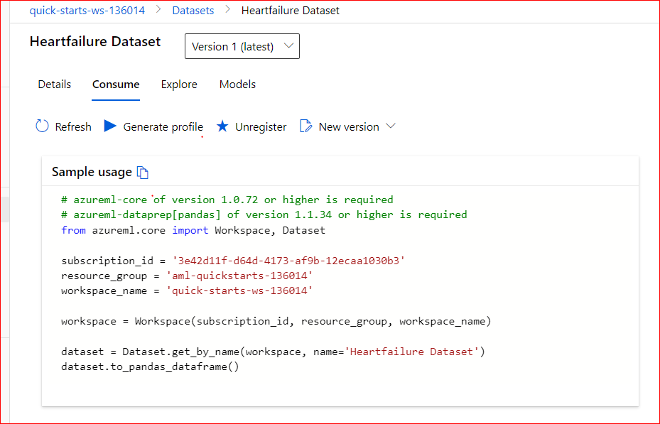

# Capstone Project

Table of Contents
=================
  * [Overview](#overview)
  * [Architecture](#architecture)
  * [Project Steps](#project-steps)
    + [Dataset](#dataset)
      + [AutoML Model](#automl-model)
      - [Pipeline](#pipeline)
      - [AutoML Config](#automl-config)
      - [RunDetails](#rundetails)
      - [Best Model](#best-model)
      - [Save and Register Model](#save-and-register-model)
    + [Hyperdrive Model](#hyperdrive-model)
      - [Pipeline](#pipeline-1)
      - [HyperDrive config](#hyperdrive-config)
      - [RunDetails](#rundetails-1)
      - [Best Model](#best-model-1)
      - [Saving Model](#saving-model)
    + [Comparison of the two models](#comparison-of-the-two-models)
    + [Model Deployment](#model-deployment)
      - [Register Model](#register-model)
      - [Deploy Model](#deploy-model)
      - [Consume Model Endpoint](#consume-model-endpoint)
      - [Services cleanup](#services-cleanup)
    + [Standout Suggestions](#standout-suggestions)
      - [Convert model into ONNX format](#convert-model-into-onnx-format)
      - [Deploy model using IoT Edge](#deploy-model-using-iot-edge)
      - [Enable Logging](#enable-logging)
      - [Publish and Consume Pipeline](#publish-and-consume-pipeline)
  * [Future Improvements](#future-improvements)
  * [Screen Recording](#screen-recording)

## Overview
This is the Capstone Project of the Udacity Microsoft MLE Nanodegree. This project leverages Azure Machine Learning to help in the Heart Failure Prediction,
ardiovascular diseases (CVDs) are the number 1 cause of death globally, taking an estimated 17.9 million lives each year, which accounts for 31% of all deaths worlwide.
Heart failure is a common event caused by CVDs and this dataset contains 12 features that can be used to predict mortality by heart failure.
Most cardiovascular diseases can be prevented by addressing behavioural risk factors such as tobacco use, unhealthy diet and obesity, physical inactivity and harmful use of alcohol using population-wide strategies.
People with cardiovascular disease or who are at high cardiovascular risk (due to the presence of one or more risk factors such as hypertension, diabetes, hyperlipidaemia or already established disease) need early detection and management wherein a machine learning model can be of great help.
 In particular, this project demonstrates the cleaning, preprocessing, and registering of an external dataset; automated machine learning; hyperparameter tuning using HyperDrive; the creation of machine learning pipelines and retrieval of its artefacts (models, transformers) and metrics; evaluation and comparison of two models; and the deployment of a trained model for use. This is a clear example of how machine learning can be applied in the Health field to help predict diseases that affect millions of people in order to predict these diseases in time and to save lives in some way. I hope this project can motivate other people to apply machine learning for the good of society.
 
The dataset contains 299 training examples in a csv file.

https://www.kaggle.com/andrewmvd/heart-failure-clinical-data

https://archive.ics.uci.edu/ml/machine-learning-databases/00519/heart_failure_clinical_records_dataset.csv.

## Architecture
First we have to choose a Dataset from an external resource like Kaggle, UCI, etc and import the dataset into the Azure ML Workspace. Then we have to train differents model using Automated ML and in the other experiment we have to train a model using Hyperdrive. After that we have to compare the performance of both best models and choose the best one in order to deploy it. Once deployed we have to test the model endpoint.

## Project Steps

### Dataset
In many areas with high poverty rates, there are hospitals with basic equipment. Patients are treated for very common ailments such as heart attacks, but many times doctors cannot help them due to lack of equipment. Thus this solution can help clinicians to predict in time whether a person is at risk of developing heart failure and thus provide treatment in a timely manner.
That's why I chose the Kaggle Cardiovascular Disease Dataset. The Heart Failure Prediction Dataset is a Kaggle dataset that contains health history of some people. And a group of them had a Heart Failure Prediction. So using this dataset, we can train a model to predict whether a person might have a Heart Failure Prediction. This data comes from hospital records, but the original source is not available.

To make predictions about heart failure, we used the open source Heart Failure Prediction dataset from kaggle to build a classification model. This dataset uses 12 clinical features for predicting death events by heart failure.

### AutoML Model

#### Pipeline
As Data Scientists we know that before training a model, we have to do some process like feature engineering in order to get better models. So for that reason I decided to build a Pipeline with steps such as cleaning data, filtering, do some transformations and split the dataset into train and test sets. The last module correspond to the AutoML in order to train several kinds of models such as LightGBM, XGBoost, Logistic Regression, VotingEnsemble, among other algorithms.

#### AutoML Config
In order to run an AutoML experiment, we have to set up some parameters in the automl_config like the classification task, the primary metric, the label column, etc. In this case, first I chose the AUC as primary metric, which means Area Under the Curve between True Positive Rate and False Positive Rate. So with this metric we can measure how well the model can distinguish two classes, the better the classification algorithm is, the higher the area under the roc curve. Then I setted up the maximum concurrent iterarions as 5 because this value has to be lower than the number of nodes of the compute cluster, for this project I created a compute cluster of size STANDARD_DS12_V2 with 6 nodes at maximum. I setted up the experiment timeout to 30 minutes because the dataset is not large and this amount of time is enough to get good models. I specified the number of cross validation as 5 folds, this means that the 20% of the dataset will be used for testing in each validation. Then I setted up the mpdel_explaibility as True in order to get later an explanation of the model, I specofied the label column as teh cardio variable because this is the variable that we wan to predict later. I used the auto featurizarion which Indicates that as part of preprocessing, data guardrails and featurization steps are performed automatically. Finally I enabled the early stopping as as form of regularization to avoid overfitting.

Then I created the AutoML step and I summitted the experiment. It took like 1 hour in order to run all the steps of the pipeline.

#### RunDetails
I used the RunDetails tool in order to get some information about the AutoML experiment. We can see I got some information of the model like the accuracy and the AUC and also the status and description of the experiment.

#### Best Model
After the experiment finished running we got different trained models, each one with its AUC metric. The best model was the VotingEnsemble with AUC=0.8021. One advantege of the AutoML is that it also gives an explanation of the model. 

#### Save and Register Model
Once I got the best model of the AutoML experiment, I saved the model in the pickle format. Also I tested the model using the test dataset in order to compare with other models. Then I registered the model using the register_model method from the AutoML run.

### Hyperdrive Model

#### Pipeline
Similar to the previous experiment, I built a Pipeline with steps such as cleaning data, filtering, do some transformations and split the dataset into train and test sets in order to do some feature engineering and help to get better models. The diffence is on the last module, which in this case is the HyperDrive step.

#### HyperDrive config
In order to run a HyperDrive experiment we have to set up some previous details. First I passed the output of the previous step (testTrainSplitStep) as input to the HyperDrive step. When reuse is allowed, results from the previous run are immediately sent to the next step. This is key when using pipelines in a collaborative environment since eliminating unnecessary reruns offers agility. Then we have to choose an algorithm to find the best hyperparameters of it. In this case I chose the LightGBM, which is a gradient boosting algorithm that uses tree-based learning. The advantages of LightGBM are that it has faster training speed and higher efficiency, lower memory usage, better accuracy and capable of handling large-scale data. So then we have to specify the LightGBM's hyperparameters to be tunned, in this case I chose the following parameters: num_leaves, max_depth, min_data_in_leaf and learning_rate. For num_leaves, max_depth and mindatain_leaf hyperparameters I defined a range of discrete values, whereas for the learning_rate hyperparameter I defined a uniform distribution of values. Then I defined the parameter space using random sampling. One of the the benefits of the random sampling is that the hyperparameter values are chosen from a set of discrete values or a distribution over a continuous range. So it tested several cases and not every combinations. It helped to reduce the time of hyperparameter tuning. Then I used the BanditPolicy as early stopping policy because it defines an early termination policy based on slack criteria, frequency and delay interval for evaluation. Any run that doesn't fall within the slack factor or slack amount of the evaluation metric with respect to the best performing run will be terminated. Then I built an estimator that specifies the location of the script, sets up its fixed parameters, including the compute target and specifies the packages needed to run the script.

Then I created the HyperDrive step using the hyperdrive_config and then I submitted the experiment.

#### RunDetails
I used the RunDetails tool in order to get some information about the HyperDrive experiment. We can see a graphic of the AUC metric versus the runs and also the map of the hyperparameters.

#### Best Model
Once the HyperDrive experiment finished running we got different trained models, each one with its AUC metric and its hyperparameters. The best model was a LightGBM algorithm with AUC=0.8029 with the following hyperparameters: learning_rate=0.016, max_depth=6, min_data_in_leaf=32 and num_leaves=16.

We can see the best model in the Azure ML Studio with its metrics and hyperparameters obtained.

#### Saving Model
Once I got the best model of the HyperDrive experiment, I saved the model in the pickle format. Also I tested the model using the test dataset in order to compare with the previous model.

### Comparison of the two models
For both experiments I used the AUC metric in order to compare them. We've seen the AUC in the validation set for the AutoML model was 0.8021, whereas for the Hyperdrive model was 0.8029. In addition I calculated the AUC in the test set, for the AutoML was 0.7317 and for the Hyperdrive model was 0.7978. So we can see that the HyperDrive model is the best one between the two models. One reason to explain this is that the HyperDrive experiment focus on just one type of algorithm and try to find the best hyperparameters, in this case is the LightGBM which is an ensamble algorithm, whereas the AutoML tried differents algorithm, some of them basic algorithm like LogisticRegression. So now, we can deploy the best model.

### Model Deployment

#### Register Model
The first step in order to deploy a model is register it. I used the register_model method from the best_run of the HyperDrive experiment. Then we can see that the model is registered.

#### Deploy Model
Beafore deploy the model, we have to create the scoring file and the environment file. Then we have to set up the parameters for the Azure Container Instance and then we can deploy the model.

The deployment process take some minutes, then we can see the information of the model deployed like the REST endpoint and the authentication keys.

#### Consume Model Endpoint
We can consume the model endpoint using the HTTP API. First we have to specify the model endpoint and the primary key for authentication. Then we have to provide the data to predict in json format. With this information we can make a request for the endpoint and it will return the predictions.

The data format required to make predictions is the following:

#### Services cleanup
After all the steps, we can delete the ACI service and also we can delete the Compute cluster from its associated workspace in order to clean up services.

### Standout Suggestions

#### Convert model into ONNX format
The Open Neural Network Exchange (ONNX) is an open-sources portability platform for models that allows you to convert models from one framework to another, or even to deploy models to a device (such as an iOS or Android mobile device). I converted the best model into ONNX format usin the onnxtool.

#### Deploy model using IoT Edge
We can also deploy a model using the Azure IoT Edge. First I had to create an IoTHub service and an IoT Edge device. Then I created the iot scoring file, similar to the scoring file, and also I created the environment file. Then I created a docker image with the previous information. I created a deployment.json file that contains the modules to deploy to the device and the routes. Then I pushed this file to the IoT Hub, which will then send it to the IoT Edge device. The IoT Edge agent will then pull the Docker image and run it. So in this way the model is deployed in the iot edge device.

#### Enable Logging
When we deploy a model, the Application Insights service is not enable by default. So we can execute a couple of lines of code to enable it. After executed it we can see now the Application Insights is enabled and we can retrieve logs.

In the Application Insights page we can see some information about the endpoint such as the server response time, the total server requets, the numer of failed requests, etc.

#### Publish and Consume Pipeline
As further step, I published the pipeline of the best model using the publish_pipeline method. It generated the Pipeline endpoint, in this case called "Cardio Pipeline" and in the portal we can see the REST endpoint and its status which is Active. 

Finally, I consumed the pipeline endpoint and the Pipeline started to run again.

## Future Improvements
We can improve this project in the future trying several options. For example in the AutoML experiment we can extend the training job time for the experiment and also we can specify the models which can be used for Experiments under Blocked model. In the Hyperdrive experiment, we can test another algorithms like XGBoost in order to get the best hyperparameters. Also we can add more steps for the pipeline, for example a step to do standarization and normalization of the variables. Finally I would recommend get an explanation of the model in order to explain the most important variables and also we can use the Fairness SDK to make an analysis if the model is getting bias for a certain variable like gender for example.

 At the end we can also do some Standout Suggestions such as convert the model into ONNX format and deploy the model using IoT Edge in order to demonstrate all the knowledge from this Nanodegree.

## Screen Recording
Finally I recorded a screencast that shows the entire process of the Capstone Project.

