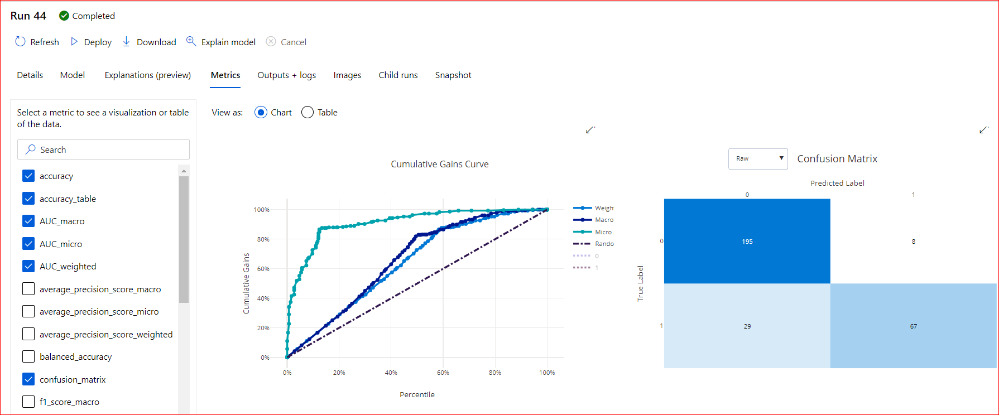

### Machine-Learning-Engineer-with-Microsoft-Azure
By Marwan Saeed Alsharabbi

# Capstone Project

Table of Contents
=================
  * [Overview](#overview)
  * [Architecture](#architecture)
  * [Project Steps](#project-steps)
    + [Dataset](#dataset)
      + [AutoML Model](#automl-model)
      - [Pipeline](#pipeline)
      - [AutoML Config](#automl-config)
      - [RunDetails](#rundetails)
      - [Best Model](#best-model)
      - [Saving Model](#saving-model)
     + [Model Deployment](#model-deployment)
       - [Register Model](#register-model)
       - [Deploy Model](#deploy-model)
       - [Consume Model Endpoint](#consume-model-endpoint)
    + [Hyperdrive Model](#hyperdrive-model)
      - [HyperDrive config](#hyperdrive-config)
      - [RunDetails](#rundetails-1)
      - [Best Model](#best-model-1)
      - [Save and Register Model](#save-and-register-model)
    + [Comparison of the two models](#comparison-of-the-two-models)
      - [Services cleanup](#services-cleanup)
  * [Future Improvements](#future-improvements)
  * [Screen Recording](#screen-recording)
  
  
 In this project we create two models: one using
 
  #### 1- Automated ML
  #### 2- Hyperparameters are tuned using HyperDrive.
  
 We then compare the performance of both the  models and deploy the best performing model. Once the model is deployed successfully we test the endpoint. 
 This project is a part of the Machine Learning Engineer with Microsoft Azure ND-Udacity. 
  
  
## Overview
This is the Capstone Project of the Udacity Microsoft MLE Nanodegree. This project leverages Azure Machine Learning to help in the Heart Failure Prediction,
ardiovascular diseases (CVDs) are the number 1 cause of death globally, taking an estimated 17.9 million lives each year, which accounts for 31% of all deaths worlwide.
Heart failure is a common event caused by CVDs and this dataset contains 12 features that can be used to predict mortality by heart failure.
Most cardiovascular diseases can be prevented by addressing behavioural risk factors such as tobacco use, unhealthy diet and obesity, physical inactivity and harmful use of alcohol using population-wide strategies.
People with cardiovascular disease or who are at high cardiovascular risk (due to the presence of one or more risk factors such as hypertension, diabetes, hyperlipidaemia or already established disease) need early detection and management wherein a machine learning model can be of great help.
 In particular, this project demonstrates the cleaning, preprocessing, and registering of an external dataset; automated machine learning; hyperparameter tuning using HyperDrive; the creation of machine learning pipelines and retrieval of its artefacts (models, transformers) and metrics; evaluation and comparison of two models; and the deployment of a trained model for use. This is a clear example of how machine learning can be applied in the Health field to help predict diseases that affect millions of people in order to predict these diseases in time and to save lives in some way. I hope this project can motivate other people to apply machine learning for the good of society.
 
The dataset contains 299 training examples in a csv file.

 The link dawnload data from [kaggle](https://www.kaggle.com/andrewmvd/heart-failure-clinical-data) or   [archive.ics.uci.edu](https://archive.ics.uci.edu/ml/machine-learning-databases/00519/heart_failure_clinical_records_dataset.csv.)

## Architecture
First we have to choose a Dataset from an external resource like Kaggle, UCI, etc and import the dataset into the Azure ML Workspace. Then we have to train differents model using Automated ML and in the other experiment we have to train a model using Hyperdrive. After that we have to compare the performance of both best models and choose the best one in order to deploy it. Once deployed we have to test the model endpoint.

## Project Steps

### Dataset
In many areas with high poverty rates, there are hospitals with basic equipment. Patients are treated for very common ailments such as heart attacks, but many times doctors cannot help them due to lack of equipment. Thus this solution can help clinicians to predict in time whether a person is at risk of developing heart failure and thus provide treatment in a timely manner.
That's why I chose the Kaggle Cardiovascular Disease Dataset. The Heart Failure Prediction Dataset is a Kaggle dataset that contains health history of some people. And a group of them had a Heart Failure Prediction. So using this dataset, we can train a model to predict whether a person might have a Heart Failure Prediction. This data comes from hospital records, but the original source is not available.

12 clinical features:

- age: age of the patient (years)
- anaemia: decrease of red blood cells or hemoglobin (boolean)
- high blood pressure: if the patient has hypertension (boolean)
- creatinine phosphokinase (CPK): level of the CPK enzyme in the blood (mcg/L)
- diabetes: if the patient has diabetes (boolean)
- ejection fraction: percentage of blood leaving the heart at each contraction (percentage)
- platelets: platelets in the blood (kiloplatelets/mL)
- sex: woman or man (binary)
- serum creatinine: level of serum creatinine in the blood (mg/dL)
- serum sodium: level of serum sodium in the blood (mEq/L)
- smoking: if the patient smokes or not (boolean)
- time: follow-up period (days)

### Task

In this project, we will predict the death prediction or Heart failure rate with the help of 12 attributes provided in the dataset. The target ("DEATH_EVENT") column with values of 1 means person will suffer from heart failure and 0 means no heart failure.

To make predictions about heart failure, we used the open source Heart Failure Prediction dataset from kaggle to build a classification model. This dataset uses 12 clinical features for predicting death events by heart failure.

### AutoML Model

#### Pipeline
As Data Scientists we know that before training a model, we have to do some process like feature engineering in order to get better models. So for that reason I decided to build a Pipeline with steps such as cleaning data, filtering, do some transformations and split the dataset into train and test sets. The last module correspond to the AutoML in order to train several kinds of models such as LightGBM, XGBoost, Logistic Regression, VotingEnsemble, among other algorithms.

#### AutoML Config
This creates a general AutoML settings object.
These inputs must match what was used when training in the portal. `label_column_name` has to be `DEATH_EVENT` for example.
Namespace: azureml.train.automl.automlconfig.AutoMLConfig

Use the AutoMLConfig class to configure parameters for automated machine learning training. Automated machine learning iterates over many combinations of machine learning algorithms and hyperparameter settings. It then finds the best-fit model based on your chosen accuracy metric. Configuration allows for specifying:

I n this model we have used Automated ML to train and tune a model to perform a classification task. The main goal of the classification models 

- experiment_timeout_hours- which is set to 30 ,i.e, 18 minutes. experiment_timeout_hours is the maximum time in hours that all iterations combined can take before the experiment terminates
 - max_concurrent_iterations- is set to 5 and it represents the maximum number of iterations that would be executed in parallel. This value should be less than or equal to the maximum number of nodes as compute clusters support one interaction running per node.
 - primary_metric- is set to accuracy and this is the metric that Automated Machine Learning will optimize for model selection.
 - a validation_data or n_cross_validation parameter, automated ML applies default techniques to determine how validation is performed. This determination depends on the number of rows in the dataset assigned to your training_data parameter.
 - nable_early_stopping- is set to true. This enables early termination if the score is not improving in the short term.
 - "featurization": 'auto'	Indicates that as part of preprocessing, data guardrails and featurization steps are performed automatically. Default setting.
 - label_column_name- is set to label =""DEATH_EVENT"" The target ("DEATH_EVENT") column with values of 1 means person will suffer from heart failure and 0 means no heart failure.
- The path is configured to project folder = './capstone-project3' and debug_log to automl_errors.log. Automl settings are also used in the configuration. I have used a custom environment saved as file conda_env.yml the savee in file inference.
- task- task is set to classification as the aim of our model is to "DEATH_EVENT") column with values of 1 means person will suffer from heart failure and 0 means no heart failure.
- compute_target-we have used remote compute target vm_size='STANDARD_DS3_V2', max_nodes=4)
- training_data - I used all the data because the data contains 299 rows that do not need to be divided as a training and test group.
- Explain model prediction by generating feature importance values for the entire model and/or individual datapoints.

 

Then I created the AutoML step and I summitted the experiment. It took like 34:07 in order to run all the steps of the pipeline.

#### RunDetails
I used the RunDetails tool in order to get some information about the AutoML experiment. We can see I got some information of the model like the accuracy and the AUC and also the status and description of the experiment.

#### Best Model
After the experiment finished running we got different trained models, each one with its AUC metric. The best model was the VotingEnsemble with AUC=0.91359 and Accurcay = 0.87633. One advantege of the AutoML is that it also gives an explanation of the model. 

#### Saving Model
Once I got the best model of the Atoml-pipline experiment, I saved the model in the pickle format. Also I tested the model using the test dataset in order to compare with the next model.

### Model Deployment

#### Register Model 
The first step in order to deploy a model is register it. I used the register_model method from the best_run of the Atoml-pipline experiment. Then we can see that the model is registered.

#### Deploy Model
Beafore deploy the model, we have to create the scoring file and the environment file. Then we have to set up the parameters for the Azure Container Instance and then we can deploy the model and the deployment process take some minutes, then we can see the information of the model deployed like the REST endpoint and the authentication keys.

Published pipline overview

Application insights of Automl service

#### Consume Model Endpoint
We can consume the model endpoint using the HTTP API. First we have to specify the model endpoint and the primary key for authentication. Then we have to provide the data to predict in json format. With this information we can make a request for the endpoint and it will return the predictions.

### Hyperdrive Model

#### HyperDrive config
In order to run a HyperDrive experiment we have to set up some previous details. First I passed the output of the previous step (heart_training.py) as input to the HyperDrive step. When reuse is allowed, results from the previous run are immediately sent to the next step. This is key when using pipelines in a collaborative environment since eliminating unnecessary reruns offers agility and save the script in experiment_folder('hyperdrive).
There are many machine learning algorithms that require hyperparameters (parameter values that influence training, but can't be determined from the training data itself). For example, when training a logistic regression model, you can use a regularization rate hyperparameter to counteract bias in the model; or when training a convolutional neural network, you can use hyperparameters like learning rate and batch size to control how weights are adjusted and how many data items are processed in a mini-batch respectively. The choice of hyperparameter values can significantly affect the performance of a trained model, or the time taken to train it; and often you need to try multiple combinations to find the optimal solution. 
In this case, you'll use a simple example of a logistic regression model with a three hyperparameter, but the principles apply to any kind of model you can train with Azure Machine Learning.
Azure Machine Learning includes a hyperparameter tuning capability through Hyperdrive experiments. These experiments launch multiple child runs, each with a different hyperparameter combination. The run producing the best model (as determined by the logged target performance metric for which you want to optimize) can be identified, and its trained model selected for registration and deployment.

#### RunDetails
I used the RunDetails tool in order to get some information about the HyperDrive experiment. We can see a graphic of the AUC metric versus the runs and also the map of the hyperparameters.

#### Best Model
Once the HyperDrive experiment finished running we got different trained models, each one with its AUC metric and its hyperparameters. 
with Best Run Id:  HD_93501b78-a2ca-4df3-9184-1a1ba57dd388_0
 -AUC: 0.8237327188940091
 -Accuracy: 0.8222222222222222
 -Regularization Rate: ['--C', '0.9939177083701627', '--max_iter', '150', '--regularization', '0.05'] .

We can see the best model in the Azure ML Studio with its metrics and hyperparameters obtained.

#### Save and Register Model
Once I got the best model of the AutoML experiment, I saved the model in the pickle format. Also I tested the model using the test dataset in order to compare with other models. Then I registered the model using the register_model method from the HyperDrive run.

### Comparison of the two models
In both experiments, I used the accuracy scale and the American University in Cairo for comparison.
- The HyperDrive experiment focuses on only one type of algorithm and tries to find the best hyperparameters.
- The focus of AutoML differs from different algorithms until you get the best suitable algorithm for the data and produce the best model. Training we can publish the best model.

#### Services cleanup
After all the steps, we can delete the ACI service and also we can delete the Compute cluster from its associated workspace in order to clean up services.

## Future Improvements
-  I built a HyperDrive step Pipeline with steps such as cleaning data, filtering, do some transformations and split the dataset into train and test sets in order to do some feature engineering and help to get better models. 
-Feature engineering can be performed
- Different feature reduction techniques could be used like PCA, RFE
- Using Cross validation techniques would help in cribbing problems like overfitting
- Th model can be converted to ONXX format and be deployed on Edge services.

## Screen Recording

Provide a link to a screen recording of the Capstone Project in action. [Link](https://drive.google.com/file/d/1qtM8zfoJqRLEoU5M96Ot8S0wXlTIKJf0/view?usp=sharing) -> 5 mintes

Provide a link to a screen recording of the Capstone Project in action. [Link](https://drive.google.com/file/d/1auJXAn2Ptf3zimwOi9bc2BUuWtngAc45/view?usp=sharing) 10 mintes

## Acknowledgement
I would like to thank Udacity for the course work and Microsoft for providing this opportunity. I have used dataset from Kaggle and would like to thank them for providing it. Resources used to complete the project are Kaggle, Udacity course work, scikit learn documentation and microsoft azure documentation.
