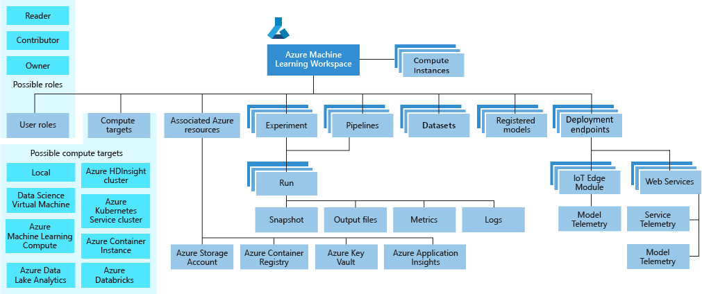
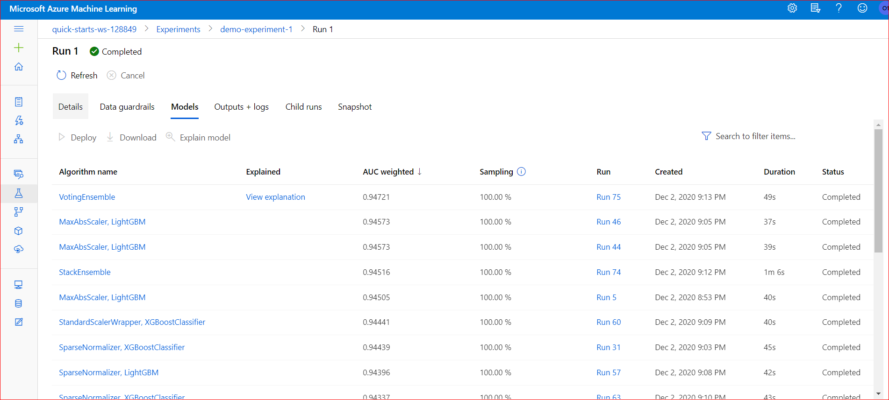
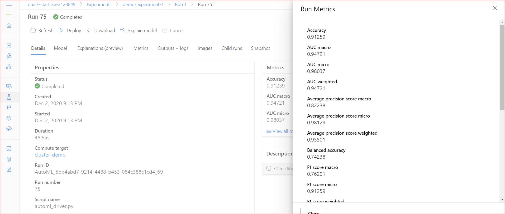
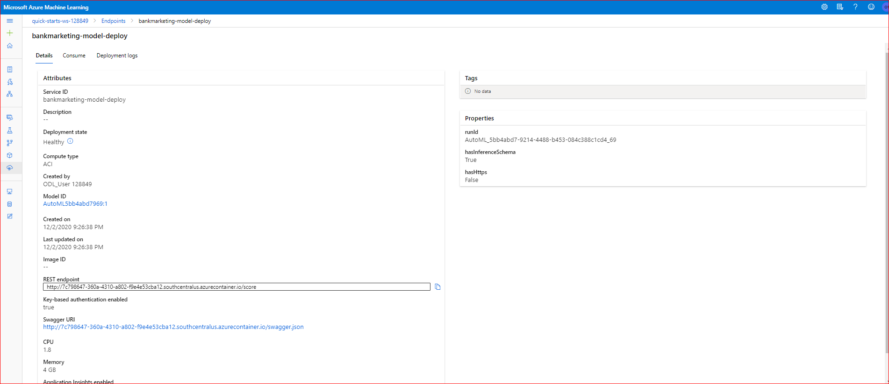

### Machine-Learning-Engineer-with-Microsoft-Azure
By Marwan Saeed Alsharabbi
  ### Project#2 Operationalizing Machine Learning
### Table of Contents
  * [Workspace](#workspace)
  * [Overview](#overview)
  * [Architectural Diagram and main steps](#architectural-diagram-and-main-steps)
  * [Project Steps](#project-steps)
      + [Authentication](#authentication)
      + [Automated ML Experiment](#automated-ml-experiment)
        - [Registered Dataset](#registered-dataset)
        - [Completed Experiment](#completed-experiment)
      + [Deploy the Best Model](#deploy-the-best-model)
      + [Enable Application Insights](#enable-Application-insights)
        - [Logging Enabled](#logging-enabled)
      + [Swagger Documentation](#swagger-documentation)
        - [Swagger UI](#swagger-ui)
      + [Consume Model Endpoint](#consume-model-endpoint)
        - [Endpoint Result](#endpoint-result)
        - [Apache Bechmark](#apache-bechmark)
      + [Create Publish and Consume a Pipeline](#create-Publish-and-Consume-a-Pipeline)
        - [Create Pipeline](#create-pipeline)
        - [Bankmarketing dataset with AutoML Module](#bankmarketing-dataset-with-automl-module)
        - [Use RunDetails Widget](#use-rundetails-widget)
        - [Publishing a pipeline](#Publishingpipeline)
        - [Scheduled run in ML Studio](#scheduled-run-in-ml-studio)
        - [Automation with pipelines](#automation-with-pipelines)
   * [improve this project in the future](#improve-this-project-in-the-future)
   * [Screencast Video](#screencast-video)

### Workspace
A machine learning workspace is the top-level resource for Azure Machine Learning.

A taxonomy of the workspace is illustrated in the following diagram:

### Overview

In this project, I will continue to work with the Bank Marketing dataset. You will use Azure to configure a cloud-based machine learning production model, deploy it, and consume it. You will also create, publish, and consume a pipeline.
Both the Azure ML Studio and the Python SDK will be used in this project. You will start with authentication and then run an Automated ML experiment to deploy the best model.
Next, you will enable Application Insight to review important information about the service when consuming the model.
And finally, you will create, publish, and interact with a pipeline.
DevOps: A set of best practices that helps provide continuous delivery of software at the highest quality with a constant feedback loop.

### Architectural Diagram and main steps
In this project, you will following the below steps:

- Authentication
- Automated ML Experiment
- Deploy the best model
- Enable logging
- Swagger Documentation
- Consume model endpoints
- Create and publish a pipeline
- Documentation

### Architectural Diagram 
This dataset contains data about direct marketing campaigns of a banking institution. The marketing campaigns were based on phone calls. So we seek to predict if the product (bank term deposit) would be ('yes') or not ('no') subscribed.

First I executed an AutoML experiment using the Azure ML platform for training several kinds of models such as LightGBM, XGBoost, Logistic Regression, VotingEnsemble, among others algorithms. After we got the best model, I deployed it and I got the REST endpoint. I enabled logging through Application Insights service. Also we covered the Swagger documentation in order to get information of the REST endpoint. Then we saw how to consume the endpoint using the HTTP API and the authentication. Finally I created and published a pipeline using the Python SDK and I got the REST endpoint of the pipeline and with that we consumed the endpoint in order to execute the pipeline. All these steps we can see in the following architecture:

## Project Steps

## Authentication
Authentication is crucial for the continuous flow of operations. Continuous Integration and Delivery system (CI/CD) rely on uninterrupted flows. When authentication is not set properly, it requires human interaction and thus, the flow is interrupted. An ideal scenario is that the system doesn't stop waiting for a user to input a password. So whenever possible, it's good to use authentication with automation.
### Authentication types
### Key- based
- Azure Kubernetes service enabled by default
- Azure Container Instances service disabled by default
### Token- based
- Azure Kubernetes service disabled by default
- Not support Azure Container Instances
#### Interactive
Used by local deployment and experimentation (e.g. using Jupyter notebook)
#### Service Principal
A “Service Principal” is a user role with controlled permissions to access specific resources. Using a service principal is a great way to allow authentication while reducing the scope of permissions, which enhances security.
New terms
CI/CD: Continuous Integration and Continuous Delivery platform. Jenkins, CircleCI, and Github Actions are a few examples.

more information  in the Reference :[Authentication](https://docs.microsoft.com/en-us/azure/machine-learning/how-to-setup-authentication)

## Automated ML Experiment
At this point, security is enabled and authentication is completed. In this step, you will create an experiment using Automated ML, configure a compute cluster, and use that cluster to run the experiment.
I will use the same Bankmarketing dataset with course 1.
### How AutoML works
During training, Azure Machine Learning creates a number of pipelines in parallel that try different algorithms and parameters for you. The service iterates through ML algorithms paired with feature selections, where each iteration produces a model with a training score. The higher the score, the better the model is considered to "fit" your data. It will stop once it hits the exit criteria defined in the experiment.
 more information  in the Reference :[automated-ml](https://docs.microsoft.com/en-us/azure/machine-learning/tutorial-first-experiment-automated-ml)

### Registered Dataset

 - Create a new Automated ML run
 
  
 - Next, make sure you have the dataset uploaded  Copy the link to a new browser window to download the data: https://automlsamplenotebookdata.blob.core.windows.net/automl-sample-notebook-data/bankmarketing_train.csv
   Upload the bankmarketing_train.csv to Azure Machine Learning Studio so that it can be used when training the model.
   
   
   
 - Create and configure your new compute cluster.
 For experiment workloads with high scalability requirements, you can use Azure Machine Learning compute clusters; which are multi-node clusters of Virtual Machines that  automatically scale up or down to meet demand. This is a cost-effective way to run experiments that need to handle large volumes of data or use parallel processing to distribute the workload and reduce the time it takes to run.
 
 - Once the new compute cluster is successfully created, use this cluster to run the autoML experiment 
                 more information in the Reference :[compute-target](https://docs.microsoft.com/en-us/azure/machine-learning/concept-compute-target)
    
 - You will see the experiment in the experiment section and a new model is created.
 
  
 
 ### Completed Experiment
 
 After the experiment run completes, a summary of all the models and their metrics are shown, including explanations. The Best Model will be shown in the Details tab. In the   Models tab, it will come up first (at the top). Make sure you select the best model for deployment.
  
  
  
  
  
  
   
Deploying the Best Model will allow to interact with the HTTP API service and interact with the model by sending data over POST requests.

## Deploy the Best Model

- Go to the Automated ML section and find the recent experiment with a completed status. Click on it.
- Go to the "Model" tab and select a model from the list and click it. Above it, a triangle button (or Play button) will show with the "Deploy" word. Click on it.
    * Fill out the form with a meaningful name and description. For Compute Type use Azure Container Instance (ACI)
    * Enable Authentication
    * Do not change anything in the Advanced section.
    
    
- Deployment takes a few seconds. After a successful deployment, a green checkmark will appear on the "Run" tab and the "Deploy status" will show as succeed.

     
     
     
     
## Enable Application Insights
Application Insights is an Azure service that helps you to monitor the performance and behavior of web applications.
It mostly captures two kinds of data: events and metrics. Events are individual data points that can represent any kind of event that occurs in an app. These events can be technical events that occur within the application runtime or those that are related to the business domain of the application or actions taken by users. Metrics are measurements of values, typically taken at regular intervals, that aren't tied to specific events. Like events, metrics can be related to the application's runtime or infrastructure (like the length of a queue) or related to the application's business domain or users (like how many videos are viewed in an hour).

 more information  in the Reference
 [Enable-application-insights](https://docs.microsoft.com/en-us/learn/modules/capture-page-load-times-application-insights/2-enable-application-insights)
 [Enable-application-insights](https://docs.microsoft.com/en-us/azure/machine-learning/how-to-enable-app-insights)
 
### Logging Enabled
 
  
  
  
  
 
 
 ## Swagger Documentation
 
  In this step, you will consume the deployed model using Swagger.

  Azure provides a Swagger JSON file for deployed models. Head to the Endpoints section, and find your deployed model there, it should be the first one on the list.

  A few things you need to pay attention to:

- Ensure that Docker is installed on your computer.
- Azure provides a Swagger JSON file for deployed models. Head to the Endpoints section, and find your deployed model there.
- Click on the name of the model, and details will open that contains a Swagger URI section. Download the file locally to your computer and put it in the same directory with serve.py and swagger.sh.

- Run two scripts:

  1-serve.py will start a Python server on port 8000. This script needs to be right next to the downloaded swagger.json file. NOTE: this will not work if swagger.json is not on    the same directory .
  
  

  2-swagger.sh which will download the latest Swagger container, and it will run it on port 80. If you don't have permissions for port 80 on your computer, update the script to a higher number (above 9000 is a good idea).
  
 ### Swagger UI
  
  
  
 - Open the browser and go to http://localhost:8000 where serve.py should list the contents of the directory. swagger.json must show. If it doesn't, it needs to be downloaded     from the deployed model endpoint
 
 
 
 - Go to http://localhost/ which should have Swagger running from the container (as defined in swagger.sh). If you changed the port number, use that new port number to reach the    local Swagger service (for example, http://localhost:9000 if port 9000 is used) 
 - On the top bar, where petsore.swagger.io shows, change it to http://localhost:8000/swagger.json, then hit the Explore button. It should now display the contents of the API      for the model
 
 
 
  - Look around at the different HTTP requests that are supported for the model
     
     
     
 
## Consume Model Endpoints

Once the model is deployed, use the endpoint.py script provided to interact with the trained model. In this step, you need to run the script, modifying both the scoring_uri and the key to match the key for your service and the URI that was generated after deployment. in the Reference ["How to consume a web service"](https://docs.microsoft.com/en-us/azure/machine-learning/how-to-consume-web-service?tabs=python)

 ### Endpoint Result
 
- In Azure ML Studio, head over to the "Endpoints" section and find a previously deployed model. The compute type should be ACI (Azure Container Instance).

- In the "Consume" tab, of the endpoint, a "Basic consumption info" will show the endpoint URL and the authentication types. Take note of the URL and the "Primary Key" authentication type.
- Using the provided endpoint.py replace the scoring_uri and key to match the REST endpoint and primary key respectively. The script issues a POST request to the deployed model  and gets a JSON response that gets printed to the terminal.
 

### Apache Bechmark
- Make sure you have the Apache Benchmark command-line tool installed and available in your path:
- Run the endpoint.py. Just like before, it is important to use the right URI and Key to communicate with the deployed endpoint. A data.json should be present. This is required for the next step where the JSON file is used to HTTP POST to the endpoint.
- In the provided started code, there is a benchmark.sh script with a call to ab similar to this:

 ab -n 10 -v 4 -p data.json -T 'application/json' -H 'Authorization: Bearer SECRET' http://URL.azurecontainer.io/score 
 
  
  

##  Create Publish and Consume a Pipeline
 For this part we used the Jupyter Notebook provided. In the notebook, firts we initialized the workspace, we specified the Azure ML experiment, attached the computed cluster, we loaded the Bank marketing dataset, we configured the AutoML using the AutoMLConfig class. We also used th AutoMLStep class to specify the steps of the pipeline. Then we created the pipeline and submitted the experiment. Once the experiment is completed, we can see the diagram of the pipeline in the Azure ML studio. We can see the pipeline first has the bankmarketing dataset module followed by the AutoML module.
 
 #### Create Pipeline 

 Automation is a core pillar of DevOps applicable to Machine Learning operations.

A good feature of Azure is Pipelines, and these are closely related to automation. Some key factors covered about pipelines are:

When creating a Pipeline. Pipelines can take configuration and different steps and there are areas you can play with when creating a pipeline 
 - Batch inference: The process of doing predictions using parallelism. In a pipeline, it will usually be on a recurring schedule
 - Recurring schedule: A way to schedule pipelines to run at a given interval
 - Pipeline parameters: Like variables in a Python script, these can be passed into a script argument
 
 #### Bankmarketing dataset with AutoML Module

 
 

 #### Use RunDetails Widget
  
  
 #### Publishing a pipeline

Then we published the pipeline using the publish_pipeline method. It generated the Pipeline endpoint, in this case called "Bank Marketing Train" and in the portal we can see the REST endpoint and its status which is Active.

Publishing a pipeline is the process of making a pipeline publicly available. You can publish pipelines in Azure Machine Learning Studio, but you can also do this with the Python SDK.
When a Pipeline is published, a public HTTP endpoint becomes available, allowing other services, including external ones, to interact with an Azure Pipeline.

   
   
   
  #### Scheduled run in ML Studio
   Once we got the Pipeline endpoint we can schedule it in order to run it every 24 hours for example. For this we used the ScheduleRecurrence class from the Azure SDK. Finally    we can consume the Pipeline endpoint using the HTTP via Python SDK. We can see in the following images the results after triggered the pipeline using the published pipeline    REST endpoint. Also at the end of the notebook we can see how to monitor the status of the pipeline run using RunDetails Widget.
   
   
   
   
   
 ##### Automation with pipelines

Pipelines are all about Automation. Automation connects different services and actions together to be part of a new workflow that wasn’t possible before.

There are some good examples of how different services can communicate to the pipeline endpoint to enable automation.

- A hosted project using version control: when a new change gets merged, a trigger is created to send an HTTP request to the endpoint and train the model.
- A newer dataset gets uploaded to a storage system that triggers an HTTP request to the endpoint to re-train the model.
- Several teams that want to use AutoML with datasets that are hosted externally can configure the external cloud provider to trigger an HTTP request when a new dataset gets saved.
- A CI /CD platform like Jenkins, with a job that submits an HTTP request to Azure when it completes without error.

#### Consume Pipeline Endpoint (API)

Pipeline endpoints can be consumed via HTTP, but it is also possible to do so via the Python SDK. Since there are different ways to interact with published Pipelines, this makes the whole pipeline environment very flexible.

It is key to find and use the correct HTTP endpoint to interact with a published pipeline. Sending a request over HTTP to a pipeline endpoint will require authentication in the request headers.

Interacting with a pipeline via an HTTP API endpoint more information in the Reference ["What are Machine Learning Pipelines"](https://docs.microsoft.com/en-us/azure/machine-learning/how-to-create-your-first-pipeline)

Use a Parallel Run Step in a pipeline. Reference: ["How to use parallel run stepin a pipeline"](https://docs.microsoft.com/en-us/azure/machine-learning/how-to-use-parallel-run-step)

## improve this project in the future
Data guardrails are run by Automated ML when automatic featurization is enabled. This is a sequence of checks over the input data to ensure high quality data is being used to train model.

We can improve this project in the future trying several options. For example in the AutoML experiment we can Enable Deep Learning option for the Classification task in order to help to featurize text data and may provide higher accuracy.

#### Feature engineering
Feature engineering is the process of using domain knowledge of the data to create features that help ML algorithms learn better. In Azure Machine Learning, scaling and normalization techniques are applied to facilitate feature engineering. Collectively, these techniques and feature engineering are referred to as featurization.
For automated machine learning experiments, featurization is applied automatically, but can also be customized based on your data. 
Finally I recorded a screencast that shows the entire process of the working ML application.
#### Extend the training job time for the experiment
Also we can extend the training job time for the experiment and also we can specify the models which can be used for Experiments under Blocked model. In the process of creation of the pipeline, we can perform several other tasks aside from training a model such as Data Preparation, Validation, Bactch scoring and combine tasks.

https://drive.google.com/file/d/1PPXQamFQGYau8BndC2CarCN0Ohw20ggH/view?usp=sharing
